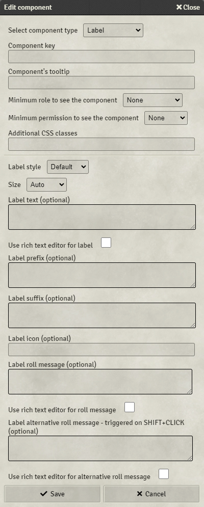

# Custom System Builder

Build your custom system without any line of code !

[](https://ko-fi.com/Z8Z6AJTSY)

> &#x26a0;&#xfe0f; **Formula changes**
>
> The formula syntax has changed, and some specific syntax has been deprecated. Here is a summary of the changes :
> - `$<colName>` becomes `sameRow('<colName>')`
> - `<dynamicTableKey>(<columnName>=<filterValue>)$<targetColumn>`
    becomes `fetchFromDynamicTable('<dynamicTableKey>', '<targetColumn>', '<columnName>', '<filterValue>')`
> - `<dynamicTableKey>$<targetColumn>` becomes `fetchFromDynamicTable('<dynamicTableKey>', '<targetColumn>')`
> - `@<property>` becomes `ref(<property>)`
> - `@$<colName>` becomes `ref(sameRow('<colName>'))`
>
> The legacy syntax will be available, while deprecated (meaning unsupported) for all Foundry v10 duration, and will be
> removed in Foundry v11. Any compted legacy syntax will trigger a warning in the Console, allowing you to update your
> formulas more easily.
>
> [More information on the new syntax here](#42-additional-functions).

## Introduction

This system is intended to easily build sheets in FoundryVTT with dynamic display and roll capabilities, in a game
agnostic way.

If you have any issue, request or question, please report
it [here](https://gitlab.com/linkedfluuuush/custom-system-builder/-/issues/new). You can also ask on
the [FoundryVTT Discord](https://discord.gg/foundryvtt), I am @LinkedFluuuush there !

For an up-to-date Roadmap, please
see [ROADMAP.md](https://gitlab.com/linkedfluuuush/custom-system-builder/-/blob/develop/ROADMAP.md) on the develop
branch.

If you want to contribute to the project, please
see [CONTRIBUTING.md](https://gitlab.com/linkedfluuuush/custom-system-builder/-/blob/main/CONTRIBUTING.md).

If you seek to extend the system or use it in macros, you
can [visit the API](https://linkedfluuuush.gitlab.io/custom-system-builder/).

If you like this system and want to support me, you can [buy me a coffee](https://ko-fi.com/linkedfluuuush) !

## Sheet library !

Seeking for existing templates working with the Custom System Builder
? [Look here if you can find something suiting you !](https://gitlab.com/linkedfluuuush/custom-system-builder/-/blob/develop/sheet-library)

If you made sheets for Custom System Builder and would like to add them to the library, please send them to me by
Discord or by creating an issue !

## Incompatibilities

- This system tinkers with initiative rolls and calculations, it might cause problems with modules modifying initiative
  as well.

## Index

[[_TOC_]]

## 1. Before we start

This system defines two Actor types : Templates (`_template`) and Characters (`character`). The `_template` type is for
sheet-building, and the `character` type uses a template to represent a Character. Templates can not be filled out, and
are not supposed to be. Their sole purpose is to build and edit sheet structures, in an easy-to-use way. Character
sheets are where the magic happens.

Sheets are divided in 2 main parts :

- The header, located under the actor's name and to the right of the character's profile picture
- The body, under both the header and the profile picture


The header and the body section both act in the same way, which is why they will be covered by the same section of this
doc.

The term `key` is used many times in this doc. It refers to an identifier of fields or tabs. It must always be a string
composed of letters (upper and lowercase), numbers and underscores only. Keys must be unique throughout the sheet.

## 2. Creating a basic sheet

To create a basic sheet, you will want to create a `_template` type actor. Template actors name should be unique, as
they will be used to link a template to a Character later on. Once your `_template` is created, its sheet opens, looking
like this.


### 2.1. Adding components to body and header

To add a component to the sheet structure, click the `+` icon in the section you want to add the component in. It will
open a pop-up dialog asking the details of your new component.



You must first choose your component's type, and you can add a key. The key will be used for various purposes, including
data-saving for the characters and HTML class added to the components in the resulting sheets.

See [here](#51-use-your-own-css) for more information on CSS enhancing.

The components' documentation is [here](#3-component-library).

Once your component has been added to the sheet, you can click on it to edit its configuration.


New buttons are available at the bottom of the pop-up dialog, allowing you to delete the component, or move it inside
its container.

### 2.3. Creating a character

When your template is complete, you can associate it to a character. Create an actor with type character, and its sheet
will open, looking like this.

.

On the top right of the sheet, a drop-down list allows you to select the template to use, and a button which applies the
template. If you modify your template, you will need to click this button again to update the character sheet. This
prevents any mistake deleting fields from the character sheets. This action is available only to GMs and Assistants.

The reload action is also available in the context menu on the characters list, though it just reloads the current
template and does not allow for template changing.

## 3. Component library

**REMINDER :** The key is sometimes optional, and MUST be unique through ALL the sheet to work properly if set. The key
must be composed of letters (upper and lowercase), numbers and underscores only.

You can add CSS classes on every component, which will be added to the rendered component on the sheet.
See [here](#51-use-your-own-css) for more information on CSS enhancing.

Each component can be limited by the current player role and permission. To see a component, the user's role AND
permission on the sheet must be above or equal to the minimum role and permission configured on the element. This allows
you to create GM Only Components or Tabs, and limit the view of non owner players on their companions sheets for
example.

Each component can have a tooltip, which is a little text displayed when hovering the mouse over the component for some
time.

### 3.1. Label

Labels are simple text rendered in the sheet. They can be dynamic and can trigger a chat message.


- Key : optional. If set, allows the label text to be re-used in [formulas](#4-formulas) by referring to the key.
- Label style : You can choose the style of the label between title, subtitle, bold text and default. This will only
  affect the label's rendering.
- Size : Specifies the size of the field. 4 options are available :
    - Auto : The field will take all the available space, resizing automatically.
    - Small / Medium / Large : The field will have a fixed size, depending on your choice.
- Label text : The label's displayed text. Can use [formulas](#4-formulas).
- Label prefix : An optional prefix for the label. Is not used in the label's saved value. Can
  use [formulas](#4-formulas).
- Label suffix : An optional suffix for the label. Is not used in the label's saved value. Can
  use [formulas](#4-formulas).
- Label icon : You can add an icon in front of the label. Use a valid [fontawesome](https://fontawesome.com) icon name,
  like `dice-d20`.
- Label roll message : If set, will post this text into a Chat Message on a click on the Label. Can
  use [formulas](#4-formulas).
- Label alternative roll message : If set, will post this text into a Chat Message on a click on the Label with Shift
  key pressed. Can use [formulas](#4-formulas). This allows for a standard roll to be set and an advanced one for
  special cases.

### 3.2. Text fields

Text fields are one-lined fields to input any string you want.


- Key : mandatory - will not save otherwise
- Label : If set, will display this label next to the field on the sheet
- Size : Specifies the size of the field. 4 options are available :
    - Auto : The field will take all the available space, resizing automatically.
    - Small / Medium / Large : The field will have a fixed size, depending on your choice.
- Allowed character list : Specifies a list of characters authorized in the field. Inputs with other characters will be
  rejected.
- Maximum length : sets the maximum number of characters the text field can accept.
- Default value : If set, the field will have this value by default

### 3.3. Number fields

Number fields are one-lined fields to input numbers.


- Key : mandatory - will not save otherwise
- Label : If set, will display this label next to the field on the sheet
- Size : Specifies the size of the field. 4 options are available :
    - Auto : The field will take all the available space, resizing automatically.
    - Small / Medium / Large : The field will have a fixed size, depending on your choice.
- Allow decimal number : Allows decimal numbers to be entered. Accepted numbers are integer only by default.
- Minimum value : sets the minimum value (inclusive) accepted in the field. This can be a [formulas](#4-formulas).
- Maximum value : sets the maximum value (inclusive) accepted in the field. This can be a [formulas](#4-formulas). If a
  maximum value is set, the field will automatically be added to the possible Attribute Bars.
- Default value : If set, the field will have this value by default
- Allow relative modification : If set, when a player enters '+x' or '-y', the operation will be done relative to the
  current value of the field, instead of directly setting the new value.
- Show field controls : If set, Number field will have a '+' and '-' button shown when mouse is over them to increment
  and decrement the value.

### 3.4. Rich text area

Rich text areas are fields which can contain enriched HTML data. They come with a WYSIWYG editor.


- Key : mandatory - will not save otherwise
- Label : If set, will display this label next to the field on the sheet
- Default value : If set, the field will have this value by default
- Style : Three styles are available
    - In sheet editor : Rich text will be displayed on the sheet, with a button to open the editor directly within the
      sheet
    - Dialog editor : Rich text will be displayed on the sheet, with a button to open a pop-up dialog containing the
      editor
    - Icon only : Only an icon to open a pop-up dialog containing the editor will be displayed on the sheet, for tight
      spaces

### 3.5. Checkbox

Checkboxes are checkboxes. Sometimes it's that simple.


- Key : mandatory - will not save otherwise
- Label : If set, will display this label next to the checkbox on the sheet
- Size : Specifies the size of the field. 4 options are available :
    - Auto : The field will take all the available space, resizing automatically.
    - Small / Medium / Large : The field will have a fixed size, depending on your choice.

### 3.6. Drop-down list

Drop-down lists are fields with limited options.


- Key : mandatory - will not save otherwise
- Label : If set, will display this label next to the field on the sheet
- Use a dynamic table column as the options : If checked, you will be able to use columns from a dynamic table to
  populate your dropdown list.
- Options : The value list displayed in the sheet. Enter one key and one Label per row. Each option must have a key.
- Dynamic table key : The source dynamic table's key.
- Column from the dynamic table to use as option key : The key of the column in the dynamic table to use as options
  keys.
- Column from the dynamic table to use as option label (optional) : The key of the column in the dynamic table to use as
  options labels.
- Default value : Optional. If set, the drop-down list will select the `key` entered as default value. If not set, the
  drop-down list will include an empty option at the beginning of the list.

### 3.7. Panel

Panels are invisible containers designed to display other components in a specific layout.


- Key : optional
- Panel layout : Sets the future components layout in the panel
    - Vertical : Components will display vertically, one after the other, taking all the available width.
    - Horizontal : Components will display horizontally, from left to right.
    - Grid : Components will display horizontally, in lines of n components.
- Panel alignment : Sets the alignment of the components
    - Center : Will center all components in their virtual column
    - Left : Will place components on the left, leaving a space on the right of the panel
    - Right : Will place components on the right, leaving a space on the left of the panel
    - Justify : Will center components in their columns, but will not leave space in the left and right of the panel.

Once created, the panel will look like this in the template editor :


The `+` button is used to add new components to the panel, in the same way as the body and header. The panel's header
indicates the panel's key for reference, and will not be shown in the definitive sheets, nor will be the outline. The
panel's header is used to edit the panel's settings.

### 3.8. Tabbed Panel

Tabbed Panels are containers designed to display other components in predefined tabs.


- Key : optional

Once created, the panel will look like this in the template editor :


The panel's header indicates the panel's key for reference, and will not be shown in the definitive sheets, nor will be
the outline. The panel's header is used to edit the panel's settings.

To add a tab to your sheet, click the `+` icon in the tab selector section. This opens a pop-up dialog to let you enter
the tab details.


You must enter the tab name, which can be anything, and the tab key.

You can edit the currently selected tab name and key with the edit button on the right, as well as delete it.
Additionally, you can reorder your tabs using the arrows on the left and right of the tab name.


### 3.9. Table

Tables are strict containers with specified column and row counts.


- Key : optional
- Row count : How many rows must the table have ?
- Column count : How many columns must the table have ?
- Table layout : This is a code to specify the columns alignment. Each column has 1 letter in the code, which indicates
  if the column should be aligned to the left (`l`), to the right (`r`) or centered (`c`).

Once created, the table will look like this in the template editor :


The `+` button are used to add new components into the table's cells, in the same way as the tabs and header. The
table's header indicates the table's key for reference, and will not be shown in the definitive sheets, nor will be the
outline. The table's header is used to edit the table's settings.

### 3.10. Dynamic table

Dynamic tables are a component allowing players to make custom lists in their sheets with a layout specification.


- Key : mandatory - will not save otherwise
- Make column name bold : If set, column names will be bold on the table, to emphasize the head of the table.
- Show confirmation dialog on row delete : If set, a confirmation dialog will be shown on click on the delete row
  button, to avoid accidental row deletion

Once created, the dynamic table will look like this in the template editor :


The `+` button is used to create new columns to the dynamic table. The dialog that opens is the same as panels, tabs and
headers components, with two additional configuration settings :


- Alignment : How the column should be aligned in the dynamic table
- Column name : If set, will be displayed as the column's name

### 3.11. Item containers

Item containers are components designed to display the items applied to an actor. Items can be filtered in the container
to ensure sheet coherence, and specific information can be added next to the items.


- Key : mandatory
- Display column names : If set, column names will be displayed on the table. Can be unset to refine the items display.
- Make column name bold : If set, column names will be bold on the table, to emphasize the head of the table.
- Show item delete button : If set, each item will be accompanied by a delete button, allowing players to delete their
  own items.
- Show confirmation dialog on item delete : If set, a confirmation dialog will be shown on click on the delete row
  button, to avoid accidental item deletion.
- Filter items
    - Select templates : You can select which item templates are eligible to be displayed in this container. This is a
      first filter for the container.
    - Add filters : You can add more filters to the displayed items. For each filter, you must enter a component's key
      present on the item, an operator and a value to check against. The value can not be a formula, it must be a fixed
      value. The `is` operator can be used to check any value. For example, to filter on checked checkboxes, you would
      use `<key> is true`.
- Item reference column label : Every item container displays at least one column, which is a reference to the item.
  This setting allows you to configure its label.
- Item reference column alignment : This setting allows you to configure the reference column alignment.

Once created, the item container will look like this in the template editor :


The `+` button is used to create new columns to the item container. The dialog that opens is the same as dynamic table
components, but with only Labels available. You can only configure labels in item containers, no value can be entered in
this component.

As with any labels, you can use formulas in the Label text and Roll Messages. The keys used in the formulas will
reference the parent keys, but you can use the item keys by adding `item.` in front of the key. For example, if a
weapon's damage value is based on the character's `STRMod` and an internal `damage` value, you can display it in the
item container with the formula `${STRMod + item.damage}$`.

Lastly : If no additional columns are set and `Display column names` is unchecked in the Item container configuration,
the items will be displayed as a vertical list without the table formatting.

## 4. Formulas

In Label text or Roll Messages, you can use Formulas to enhance your sheets.

### 4.1. Plain formulas

To mark a formula, inside your text, use the delimiters `${` and `}$`. Inside thoses delimiters, you can use the keys
you defined for any label, text field, rich text area or checkbox. You can also use mathematical operators, as well as
common mathematical functions, such as `floor()`, `ceil()` or `abs()`. Formulas are parsed
with [the math.js library](https://mathjs.org), so you can use any expression valid in this library. Here
is [a summary of the syntax](https://mathjs.org/docs/expressions/syntax.html)
and [a summary of the available functions](https://mathjs.org/docs/reference/functions.html).

For example, the modifier formula for Strength in DnD can be expressed as `${floor((STR - 10) / 2)}$`, assuming the
Strength input was given the key `STR`.

### 4.2. Additional functions

In addition to the math.js library, a few specific functions are available in the system.

> &#x26a0;&#xfe0f; **When to use quoted strings and when to use direct field key ?**
>
> In the following functions, you'll see use of quoted `''` field keys and unquoted ones. The difference between the two
> forms is that unquoted field keys will be replaced by their value at runtime.
> For example, for an `hp` field with value `10`, `function(hp)` would be equivalent to `function('10')`. For the `ref`
> function for example, this is a problem :
> `ref(attribute)` aims at getting the value of the field referenced by the `attribute` field. If `attribute`'s value
> is `str`, `ref(attribute)` is equivalent to `ref('str')`, and will return the value of the field `str`.
> And `ref('attribute')` will return the string `str`.
>
> Examples of this are given in the function's description, please read them carefully !

#### 4.2.1. fetchFromDynamicTable

`fetchFromDynamicTable(dynamicTableKey : String, targetColumn : String, [filterColumn : String], [filterValue : String | Number | boolean]) : Matrix`

This function is used to retrieve values from a dynamic table. Values can be filtered by a different column.

**Arguments**

- **dynamicTableKey** : String

The key to the dynamic table to get the value from

- **targetColumn** : String

The column key from which to get the values

- (optional) **filterColumn** : String

An optional column key to filter the results.

- (optional) **filterValue** : String | Number | boolean

The value to filter the results. If not provided, nothing will be returned.

**Returns**
A Matrix containing all the column values where filter is met.

**Examples**

- Fetch all values

Suppose you have the following Dynamic Table, whose key is `equipment` :

| Name (key `name`) | Weight (key `weight`) | Location (key `location`) |
|-------------------|-----------------------|---------------------------|
| Sword             | 50                    | Backpack                  |
| Deck of cards     | 2                     | Pocket                    |
| Shield            | 30                    | Backpack                  |

`fetchFromDynamicTable('equipment', 'weight')` : Will return a Matrix containing all the weights from the Dynamic Table
equipment, here : `[50, 2, 30]`

- Fetch values with filter

With the same table, you can add a filter to get only the Backpack items.

`fetchFromDynamicTable('equipment', 'weight', 'location', 'Backpack')` : Will return a Matrix containing all the weights
from the Dynamic Table
equipment, where `location` is equal to `Backpack`, here : `[50, 30]`

- Filter values with another field

Suppose you have the following Dynamic Table, whose key is `skills` :

| Name (key `name`) | Level (key `skill_level`) |
|-------------------|---------------------------|
| Craft             | 5                         |
| Lock-pick         | 2                         |
| Hide              | 7                         |
| Craft             | 7                         |

`fetchFromDynamicTable('skills', 'value', 'name', selectSkill)` : Will return a Matrix containing all the values from
the Dynamic Table skills, for the rows which name is equal to the value of the field `selectSKill` (Notice `selectSkill`
does not have quotes around it, meaning it is a field in the sheet).

If `selectSkill`'s value is 'Lock-pick', this will return `[2]`.

If `selectSkill`'s value is 'Craft', this will return `[5, 7]`.

#### 4.2.2. first

`first(list : Array<T> | Matrix<T>, [fallbackValue : *]) : T`

Returns the first value of an Array or a Matrix.

**Arguments**

- **list** : Array<T> | Matrix<T>

An array or a matrix containing elements of type T (usually String, Number or boolean).

- (optional) **fallbackValue** : *

This value will be returned if list is empty or null.

**Returns** The first value of list, or fallbackValue if list is empty or null.

**Examples**

With the `skills` Dynamic table defined in the previous part.

`first(fetchFromDynamicTable('skills', 'value', 'name', 'Craft'), 0)` : Will get the value of the first Craft skill if
the skills Dynamic Table, or 0 if Craft is not in the table. Here, this will return `5`.

You will need to use `first` to get values as Numbers, even if the Dynamic Table's filter returns only one row. The
function `fetchFromDynamicTable` returns a Matrix, which is not suited for other operations.

#### 4.2.3. sameRow

`sameRow(columnName: String, [fallbackValue: *]) : String | Number | boolean`

Returns the value of the column with the key `columnName` in the current row in a Dynamic Table.

**Arguments**

- **columnName** : String

The key of the column to target.

- (optional) **fallbackValue** : *

The value to return if the column is not found or does not contain data.

**Returns** the value of the column with the key `columnName` in the current row in a Dynamic Table, or `fallbackValue`
if the column does not exist or does not contain data.

**Examples**

Suppose you have the following Dynamic Table, whose key is `skills` :

| Name (key `name`) | Base (key `base_value`) | Bonus (key `bonus_value`) |
|-------------------|-------------------------|---------------------------|
| Craft             | 5                       | 3                         |
| Lock-pick         | 2                       | 4                         |
| Hide              | 7                       | 2                         |
| Craft             | 7                       | 3                         |

If your skill level is the `base_value` + the `bonus_value`, you can automate this calculation by
using `sameRow('base_value', 0) + sameRow('bonus_value', 0)`. These
functions will get the value of respectively `base_value` and `bonus_value` in the same row as the Formula being
computed, or `0` if the value is undefined. This would get you the following Dynamic Table.

| Name (key `name`) | Base (key `base_value`) | Bonus (key `bonus_value`) | Level (key `skill_level`)                                          |
|-------------------|-------------------------|---------------------------|--------------------------------------------------------------------|
| Craft             | 5                       | 3                         | `${sameRow('base_value', 0) + sameRow('bonus_value', 0)$}` => `8`  |
| Lock-pick         | 2                       |                           | `${sameRow('base_value', 0) + sameRow('bonus_value', 0)$}` => `2`  |
| Hide              |                         | 5                         | `${sameRow('base_value', 0) + sameRow('bonus_value', 0)$}` => `5`  |
| Craft             | 7                       | 3                         | `${sameRow('base_value', 0) + sameRow('bonus_value', 0)$}` => `10` |

#### 4.2.4. ref

`ref(valueRef : String, [fallbackValue : *]) : *`

Returns the value of the field with the key in valueRef.

**Arguments**

- **valueRef** : String

The key of the field to get the value from.

- (optional) **fallbackValue** : *

The value to return if the key referenced has no value.

**Returns** the value of the field which has the key pointed by valueRef, or fallbackValue of valueRef does not point to
a valid field.

**Examples**

`ref('hp')` Returns the value of the field with the key `hp`

`ref(currentArmor)` Returns the value of the field targeted by `currentArmor`. If `currentArmor` is a field
containing `lightArmorProtection` for example, this will return the value of the `lightArmorProtection` field.

`ref(sameRow('attribute'))` Returns the value of the field targeted by the column `attribute` in the current row of a
Dynamic Table.

### 4.2.5 replace

`replace(text : String, pattern : String, replacement : String) : String`

The `replace()` function replaces the first occurrence of the pattern in the text with the replacement.

**Arguments**

- **text** : String

The text you want to modify. It can also be a key to a field.

- **pattern** : String

The pattern which will be replaced.

- **replacement** : String

The replacement text, which will replace the pattern.

**Returns** the new text with the replacement.

**Examples**

`replace('My test test', 'test', 'dog')` Replaces the first occurance of 'test' with 'dog'. Output: `My dog test`.

`replace(MyInputText, 'random', '')` With 'MyInputText' = `This is a random sentence. Very random!` =>
Returns: `This is a  sentence. Very random!`

### 4.2.6 replaceAll

`replaceAll(text : String, pattern : String, replacement : String) : String`

The `replaceAll()` function replaces all occurrences of the pattern in the text with the replacement.

**Arguments**

- **text** : String

The text you want to modify. It can also be a key to a field.

- **pattern** : String

The pattern which will be replaced.

- **replacement** : String

The replacement text, which will replace the pattern.

**Returns** the new text with the replacement.

**Examples**

`replaceAll('My test test', 'test', 'dog')` Replaces all occurances of 'test' with 'dog'. Output: `My dog dog`.

`replaceAll(MyInputText, 'random', '')` With 'MyInputText' = `This is a random sentence. Very random!` =>
Returns: `This is a sentence. Very !`

### 4.2.7 recalculate

`recalculate(formula : String) : String | Number | boolean`

This function is used to recalculate a value. This can be used for custom formulas from a Text Field or a Rich Text Area.

**Arguments**

- **formula** : String

The formula which should be recalculated. It needs to contain `${}$` as usual. Can be a key to a field with a formula.

**Returns** the result of the calculation.

**Examples**

`recalculate('${Strength + 3}$')` With 'Strength' = `7` => Returns: `10`

`recalculate(MyInputFieldKey)` With 'MyInputFieldKey' = `${round(Strength / 2)}$` and 'Strength' = `5` => Returns: `3`

### 4.3. Conditions

You can add conditions to your formulas using the ternary operator : `<condition> ? <value if true> : <value if false>`.

The condition part is evaluated as a boolean :

- You can use comparison operators like
    - `==` for equality
    - `>` and `>=`, respectively 'greater than' and 'greater than or equals'
    - `<` and `<=`, respectively 'lower than' and 'lower than or equals'
    - `!=` for 'not equals'
- Any number higher than 0 will be considered true
- You can directly use the key of a checkbox to test it is checked
    - Example : `${ checkboxKey ? 'Checked' : 'Not checked' }$`

> &#x26a0;&#xfe0f; **Some common syntax in other programming languages won't work**: For example, you can not use the '
> NOT' `!` operator.

### 4.4. Use text !

You can add text to your formulas to add flavor to your sheets and messages. To use text, you must enclose it in
quotes `'`. If you wish to use a quote in the text, you can prefix it by a backslash `\`, it will be parsed correctly.
For example : `${'You can\'t use this item !'}$`

You can concatenate predefined text and field values by using the function `concat()`. If you do so, field values must
be enclosed in the `string()` function to work correctly. For
example : `concat('Deal ', string(strMod+dmgMod), ' damage to the target.')`.

### 4.5. Add rolls

You can use rolls in your formulas. To do so, inside the formula markers, use brackets (`[` and `]`) to define your
rolls. In roll expressions, you can also use keys, but you must surround them with colons. Rolls are performed using
FoundryVTT Roll API.

For example, to roll for Shadowrun's Strength, you can define the following formula : `${[:STR:d6cs>=5]}$`.

Roll operations can be defined inside the roll, or outside. In terms of pure result, `${[1d20 + 3]}$`
and `${[1d20] + 3}$` are equivalent, but I would recommend using the latter.

You can also use Roll Tables, using the syntax `[#<rollTableName>]`. Just put a `#` before your roll table name, inside
brackets, and the system will roll its default formula and integrate the result in the message.

You can customize the Roll Table formula by adding a Roll formula in this
syntax : `[#<rollTableName>|<rollFormula>]`. The formula must follow roll formula syntax, with `::` to delimit the keys.
This formula can be a Dice roll or a constant value, the latter drawing always the same result from de Roll Table.

When used in chat messages, formulas are explained by a small box displayed on click.


> &#x26a0;&#xfe0f; **Rolls can be used only in messages, not in label values.**

> &#x2139;&#xfe0f; The roll system is compatible with the Dice so Nice module !

### 4.6. Reuse formula results

In many cases you will want to re-use formula results in a chat message, to display additional information. You can
assign a formula result to a variable using the operator `:=`. You can then reuse the variable as a key later on in the
same message.

For example, using Warhammer's SL system :

```
Rolling ${roll:=[1d100]}$.
SL = ${SL:=floor(WS/10) - floor(roll/10)}$.
Damage : ${9 + SL}$
```

### 4.7. User inputs

You can ask for user inputs in formula using the syntax `?{<varName>}`. This will open a pop-up dialog during formula
computing asking for all the inputs in the formula.

You can add default values for inputs by adding it after a vertical bar, like so : `?{<varName>|<defaultValue>}`.
The `defaultValue` can be a formula, without the enclosing `${}$`. If `defaultValue` is a character string, it should be
enclosed by quotes `'`.

The user inputs variables can be reused later on as keys in the same message.

> &#x26a0;&#xfe0f; **User inputs can be used only in messages, not in label values.**

### 4.8. Hide formulas in chat messages

When using formulas in chat-messages, you can hide some formulas to perform preliminary calculations assigned to
reusable variables. To do so, prefix your formula with `#`, for example :

`${#testResult := target - roll}$`

> &#x26a0;&#xfe0f; **Formula hiding can be used only in messages, not in label values.**

### 4.9. Do not include explanation in chat message

When using formulas in chat-messages, you can use the Formula's result as is, without it being enclosed in the clickable
box with the explanations. This can be useful if you want to call a macro with parameters calculated from Formulas. To
do so, prefix your formula with `!`, for example :

`/myMacro ${!target - roll}$`

> &#x26a0;&#xfe0f; **Explanation hiding can be used only in messages, not in label values.**

## 5. Items !

Okay, we now know how to build a basic character sheet, and how to augment it with automatic calculations and generated
chat messages. Let's dig more and enter the wonderful world of Items !

An Item in FoundryVTT represents everything that is not a character for which you want to have a sheet. It can be actual
items like weaponry or armours, or more abstract concepts like species or classes. Item can be attributed to actors or
other items by dragging and dropping them onto other sheets. Caution : This attribution process creates a clone of said
item, so any changes to an item's values won't be reported on attributed versions of the item, and vice versa.

### 5.1. Equippable items

To create items, you need to create a `_equippableItemTemplate` for the item. This works just like the actor's template
creation, so I won't be detailing it any further.

Once the template is created, you can create an `equippableItem` and select its template just like you do for actors.
The sheet renders, and you can fill the fields in.

On each `equippableItem` sheet, you will find a `Make item unique` checkbox. Checking it will prevent anyone from adding
multiple instances of the item to an actor sheet.

### 5.2. Item modifiers

On the `equippableItem` sheet, you can find a `Configure item modifiers` button. This button opens a window allowing you
to create modifiers which will be applied to any actor this item is assigned to.

When creating a modifier, you must enter 4 configuration data :

1. **Priority** : This indicated the order in which the modifiers will be applied, should multiple modifiers affect the
   same property. Lower values will be applied first. If multiple modifiers have the same priority, they are ordered by
   their operator : set are applied first, then multiplications, then divisions, then addition and finally subtraction.
   If multiple modifiers share the same priority and operation, their order is irrelevant as the mathematical result
   will be the same.
2. **Key** : This is the key of the property to modify in the owner actor. **This must be the key of a number containing
   Label (except for Set-operations).** Modifiers don't work on inputs. The key must also be a first-level Label, it cannot be a reference to a
   Dynamic Table field.
3. **Operator** : This indicates which operation the modifier should do : Addition (`+`), Subtraction (`-`),
   Multiplication (`x`), Division (`/`) or Set (`=`). The Set-operation sets the field to the modifier value with no
   other operation.
4. **Formula** : This is the value of the modifier. This can contain formulas, which will be calculated from the item's
   data. This must be a **number** in the end for the computation to work. Text values can only be used with the Set-operation.
   There is also the possibility to not set a value if the formula result is '' (empty string), meaning that '' (empty string) would leave the referenced key untouched.


### 5.3. Sub templates

There is another item type in Custom System Builder : the sub template. This item type can be used to create reusable
template parts that can be added to other templates. The creation of this item is the same as any other templates,
except it has no header. It also can not be used to create a definitive item.

When created, it can be dragged and drop on any other template (actor template, equippable item template and sub
templates). When dragging on a sheet, a grey outline will show you where the template can be dropped. Once dropped, each
component defined on the subtemplate will be copied to the final template as is.

> &#x26a0;&#xfe0f; **This creates a copy of the elements. Any further modification on the subtemplate will not replicate
> to the definitive template. You will need to drop it again on the sheet to re-copy the components.**

## 6. Chat extensions

The Custom System Builder offers some convenient chat message extensions to write your own macros !

### 6.1. Roll Data and Token Data

Character properties are provided directly at the top of the RollData object. This means that you can use them directly
with FoundryVTT roll system, like described [here](https://foundryvtt.com/article/dice-advanced/#data).

These properties are also available directly at the top of the TokenData object, meaning anything asking for a token
variable can receive a property path.

### 6.2. Property reference inside a chat message

You can directly include a property inside a chat message by using the following syntax : `@{<actor>|<propertyKey>}`.
Actor can be one of the following :

- `selected`, which will reference the selected token on the map or, if no character is selected, the default player's
  character.
- `target`, which will reference the targeted token on the map.
- Any character name, which will reference this character directly.

The referenced properties can be anything included in the roll data. You must use the property's key to reference it.
You can additionally reference a specific row in dynamic table by using the following
syntax : `@{<actor>|<dynamicTableKey>(<filterColumn>=<filterValue>).<targetColumn>`.

This will retrieve the value of `<targetColumn>` in the first row of the Dynamic Table where `<filterColumn>` is equal
to `<filterValue>`.

For example, if you have a Skill table and want to retrieve the score of the `Lock picking` skill, you can
use `skill(name=Lock picking).score`.

### 6.3. `/sheetRoll` command

> &#x26a0;&#xfe0f; **This feature needs the module _chatcommands installed and with version at least 1.4.0**

You can roll a predefined roll from a chat message with the `/sheetRoll` chat command. It is used with the key to the
label containing the roll you want to trigger. For example : `/sheetRoll str` to trigger the roll associated with
the `str` label.

To trigger dynamic table rolls, you must use a filter like the property reference, for
example : `/sheetRoll skill(name=Lock picking).score` to trigger the roll associated with the label in the `score`
column of the dynamic table `skill`, on the row which `name` is `Lock picking`.

The roll will be triggered for the currently selected character on the map, or the default player's character if no
character is selected.

## 7. Macro support

### 7.1. Roll context menu

When right-clicking on a roll on a Character sheet, a context menu will appear, with options regarding macros. Three
options are available :

1. Add as macro
    - This will show a dialog to create the new macro, asking for its name and place in the macro hotbar. When created,
      the macro configuration window will open for more configuration.
2. Copy chat command
    - This will copy the `/sheetRoll` command for this roll into your clipboard, allowing you to reuse it later.
3. Copy macro script
    - This will copy a basic script into your clipboard to use the roll in a script-type macro. This script is
      customizable to your needs.

This menu is only available on Labels which have keys.

### 7.2. Macro API

In a macro, you can use some of this system's features to enhance your game.

#### 7.2.1. `actor.roll`

With the `actor` object, which references the current actor, you can use the `roll` method to trigger a chat roll.

```
actor.roll(rollCode: string, [{ postMessage: boolean }]): ComputablePhrase
```

- `rollCode` is the code used with `/sheetRoll`
- `postMessage`: if `true`, will automatically post the message to the chat

The ComputablePhrase object returned by the method is detailed below.

#### 7.2.2. `ComputablePhrase`

The `ComputablePhrase` class is the core of this system's formulas. Its purpose is to compute the formulas entered in
Labels and Rolls. And it is available in macros !

You can use it like the examples under. For more information, please refer to
the [API](https://linkedfluuuush.gitlab.io/custom-system-builder/ComputablePhrase.html).

```javascript
let phrase = new ComputablePhrase("This character's strength is ${str}$ (Mod : ${floor(str-10)/2}$).");
// Computing phrase with only one prop
await phrase.compute({str: 12});

// phrase.result returns the fully computed phrase as a String 
console.log(phrase.result);
```

```javascript
let phrase = new ComputablePhrase("Rolling for Weapon Skill<br/>Target : ${target:=WS}$<br/>Roll : ${roll:=[1d100]}$ -- ${roll <= target ? (roll % 11 == 0 ? 'Critical success !' : 'Success') : (roll % 11 == 0 ? 'Critical fail !' : 'Fail')}$<br/>Result : ${floor(target/10) - floor(roll/10)}$ SL (${target - roll}$)");
// Computing phrase with actor rollData
await phrase.compute(actor.getRollData());

// buildPhrase is a working string in which each formula has been replaced by a unique alphanumeric identifier
let buildPhrase = phrase.buildPhrase;
// values are the computed formulas of the phrase, indexed by the same unique alphanumeric identifier
let values = phrase.values;

// Rebuilding the phrase and setting each computed value bold
for (let key in values) {
    buildPhrase = buildPhrase.replace(
        key,
        '<b>' + values[key].result + '</b>'
    );
}

console.log(buildPhrase);
```

## 8. And more !

### 8.1. Configure your sheets default display settings

You can configure various display options in the template, with the `Configure sheet display` button.

You can configure the sheet default display width and height, the profile picture size and the header fields placement.

### 8.2. Add complex attribute bars

You can add simple attribute bars by adding Number fields with a maximum value parameter. But what if your attribute
bar's value is automatically calculated ?

Then you just need to click the Configure Attribute Bars button in the template, and add you attribute bar settings
there. Each bar must have a Name, a Value and a Maximum. The Value and the Maximum can both be [formulas](#4-formulas) !

### 8.3. Use Active Effects

Active effects are added to a token by a submenu in the token view. By clicking on an icon, you can add an active effect
to the character represented by the token. And now, you can add modifiers triggered by Active Effects !

In the template sheet, click the `Configure active effects` button. From here, a window opens with all the active
effects available to be modified. For each active effect, you can set any number of modifier you want, acting the same
way as [item modifiers](#52-item-modifiers).

### 8.4. Use your own CSS

You can customize your sheets with your own CSS. You can add a CSS file in the system configuration. The path must lead
to a CSS file, starting from Foundry's Data Directory.

### 8.5. Initiative formula

In the system settings, you can set your custom initiative formula. This formula must be formatted like a roll formula,
returning only an integer. The `${}$` must not be set around the formula.

### 8.6. Roll visibility

By default, chat messages with rolls will follow FoundryVTT's roll visibility's system, meaning that the messages will
always be visible by everyone but

- When Public Roll is selected, the roll & formulas data will be visibile by everyone.
- When Private GM Roll is selected, the roll & formulas data will be visible by the GM and the message's author, other
  players will see a question mark instead.
- When Blind GM Roll is selected, the roll & formulas data will be visible by the GM only, other players will see a
  question mark instead.
- When Self Roll is selected, the roll & formulas data will be visible by the author only, other players will see a
  question mark instead.

In the system's settings, you can expand the roll visibility to the whole messages posted using the sheets. The message
will be whispered to its recipients only, and not polluting the chat Log. Players will still be able to show the message
to everyone using the right-click > Show to everyone option, and the roll and formulas data will follow the rules above.

### 8.7. Roll Icons

You can add an icon next to rollable labels to make them more visible. To do so, in the system configuration enter a
valid [fontawesome](https://fontawesome.com) icon name, like `dice-d20`, to show this icon next to all rollable items.

### 8.8. Diagonal movement configuration

You can configure diagonal movement measurement in the system settings. You have 4 choices for the measurement rule :

- **Equidistant** : Diagonal movement has the same value as straight movement on the scenes
- **Alternating** : Diagonal movement alternates between 1 and 2 times the straight movement (Pathfinder style)
- **Euclidian** : Diagonal movement is calculated as the hypotenuse of the triangle formed with the straight path needed
  for the movement.
- **Custom** : You can enter a custom multiplier for diagonal movement, which will be applied to the straight movement
  value.

### 8.9. Export your templates

You can export your templates using the button in the settings tab, and reimport them in another instance using the
Import button. This will import every template configuration. If the receiving instance has templates with names
existing in the export file, the templates will be overwritten.

### 8.10. Extend the system

You can extend the system by adding your own component types to it, from a module. To do so, you must create a class
inheriting the `Component` class. Two additional abstract classes are present in the base system : `InputComponent`,
designed to represent Components which can receive user inputs and `Container`, designed to represent Components holding
other Components.

Once your class is developed, you can add it to the system by
calling `componentFactory.addComponentType('<componentTechnicalName>', <Class>);` in the Hook `customSystemBuilderReady`
.

Example :

```javascript
Hooks.once('customSystemBuilderReady', () => {
    componentFactory.addComponentType('myAwesomeComponent', AwesomeComponent);
});
```

Please refer
to [the API for Component implementation](https://linkedfluuuush.gitlab.io/custom-system-builder/Component.html).

Please let me know by an issue if you implement a Component you think should be available to all ! Link your
implementation, and I'll most likely add it to the system !

## 9. Special Thanks

Thanks to Seregras for the [Sandbox System Builder](https://gitlab.com/rolnl/sandbox-system-builder) which inspired me
very much building this system. I hope I will not cause too much trouble to them, after building a "concurrent" system.

Thanks to the FoundryVTT dev community for their help and reactivity on the Discord !

Thanks to Martin1522 for his help on the code :)

Thanks to Graham Wallis, RafaelC, ForjaSalvaje, darleth, RoxanneClark, Havoc, Nephilim, Gcolgate, Martin1522,
Gabryel, RomainMoreau and Jessica for the Coffees !